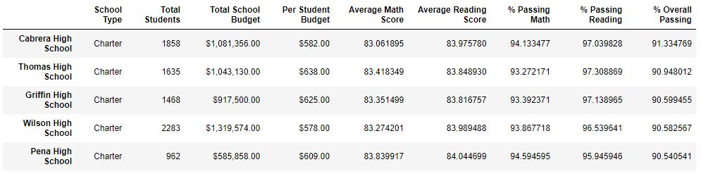
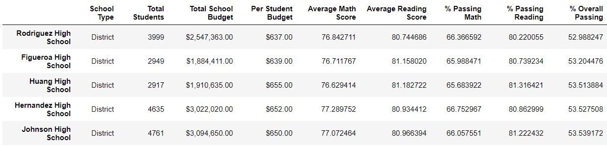
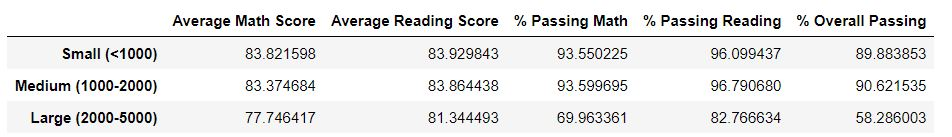
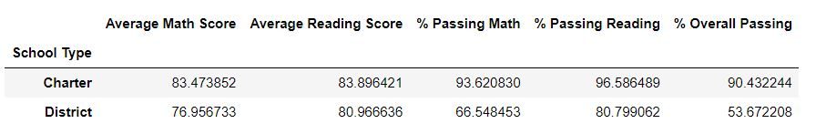

# pandas-challenge
## PyCity School

## Purpose of Project

 I am the Chief Data Scientist for my city's school district, helping the school board and the mayor make strategic decisions about future school budgets and priorities.

Currently I am analyzing district-wide standardized test results. I have access to the math and reading scores of all students, as well as various information on the schools they attend. I am working on aggregating the data to illustrate obvious trends in school performance.

## Result

## Highest-Performing Schools (by % Overall Passing)

## Bottom-Performing Schools (By % Overall Passing)

## Scores by School Size

## Scores by School Type

## Analysis

Charter schools achieved higher testing scores and higher passing percentages than the District schools. 

School size has an effect on test scores. As the school increases in size, their test scores start to trend down. This could speak to the effectiveness of the teachers in a larger class size.

School spending per student did not increase math and reading scores. In fact, schools with higher spending ($645-$675 per student) actually performed low compared to schools with smaller budgets ($585 per student).

Overall, charter schools out-performed the public district schools across all metrics. Student population in charter schools are smaller in size, allowing it to make big impact on teaching environments.

[def]: image.png